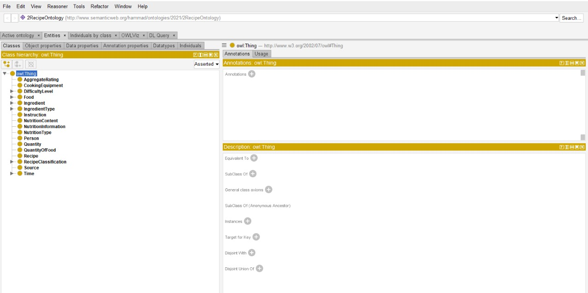

# recipe-ontology
Our ontology describes the real purpose of generating new recipes information .
<h1>Ontology description</h1>
To use this ontology, you need to follow couple of steps.
<h2>Steps:</h2>
<ul>
  <li> First, you need to download a software called Protégé developed by Stanford university. It is a free, open-source ontology editor and framework for building intelligent systems.</li>
   <li>Download the software using given link and extract it into a folder in your system.
https://protege.stanford.edu/ </li>
   <li> 	Execute protégé.exe and go to file and open the ontology to view its classes, data properties, instances and relationship between them.</li>

 </ul>

<h5>Here are few screenshots to make you familiar with the software.</h5>

